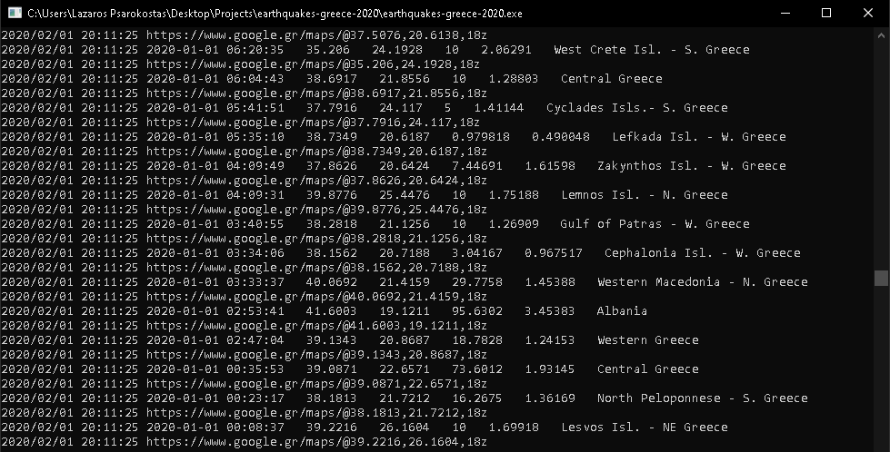
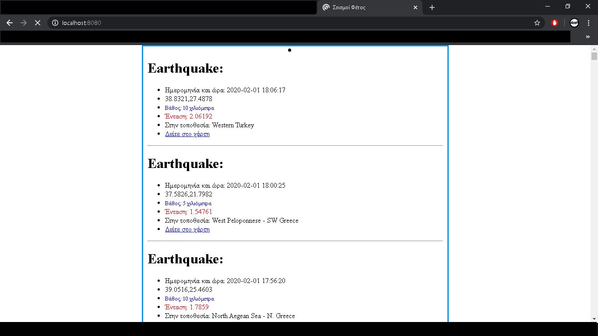

# earthquakes-greece-2020
Mini project to inform user about earthquakes at greece of all 2020

---
You just run 

go build 

into folder and run the executable that produced...

visit localhost:8080 from your favorite browser and see...

Also this program export all infos into log file when you run it...
---
You must have internet connection & Golang 1.6 or newer installed on your machine

